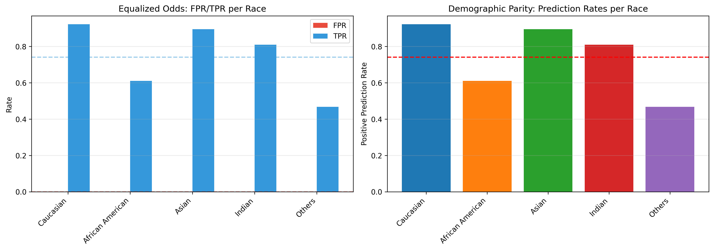
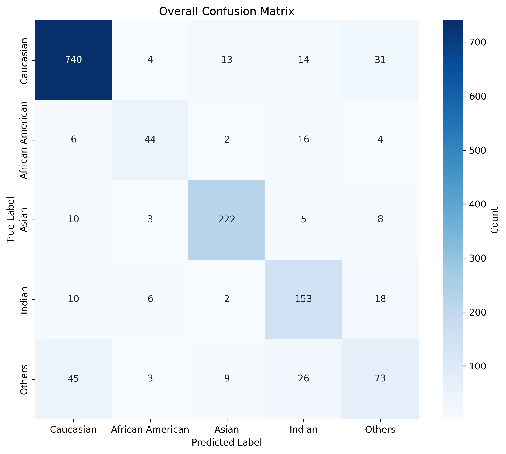
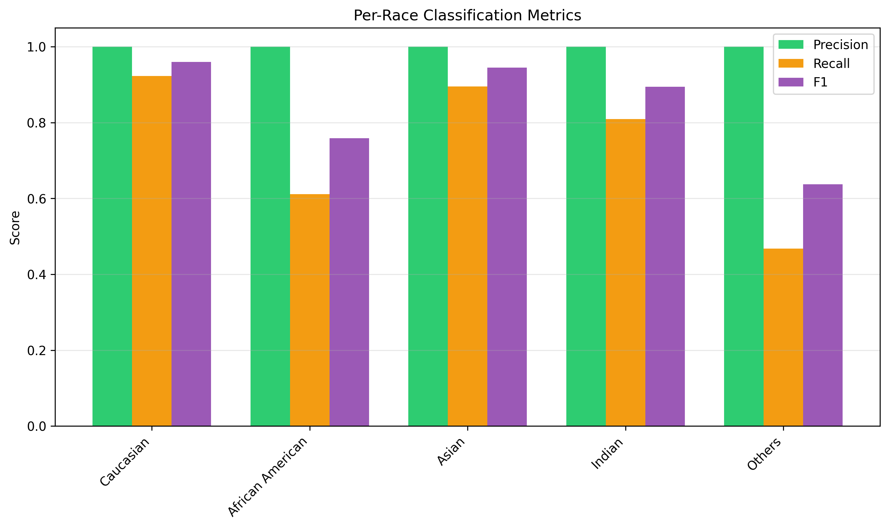
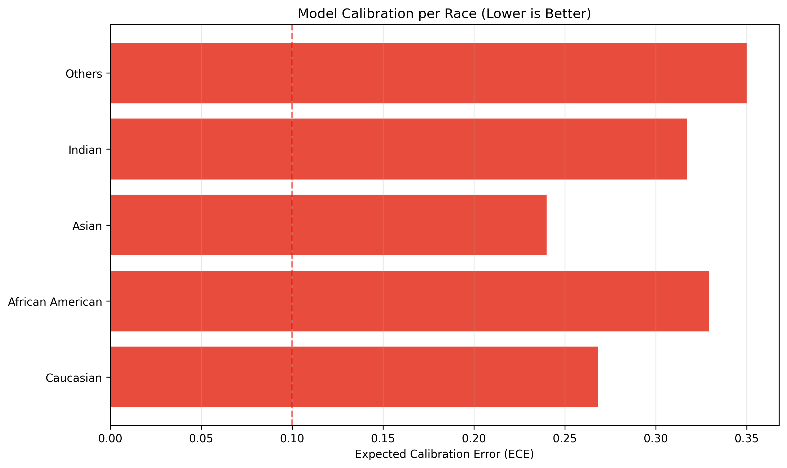
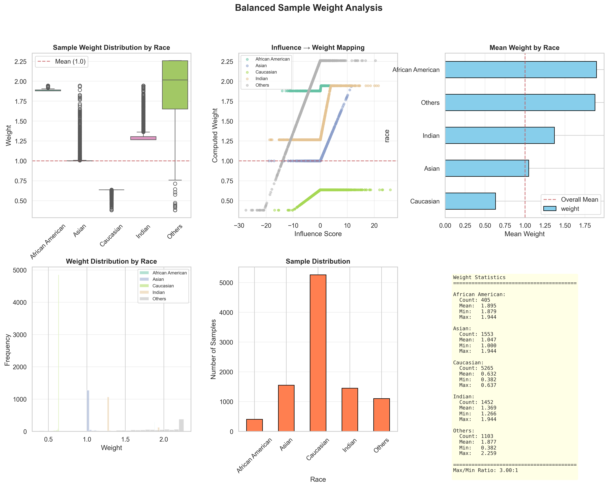
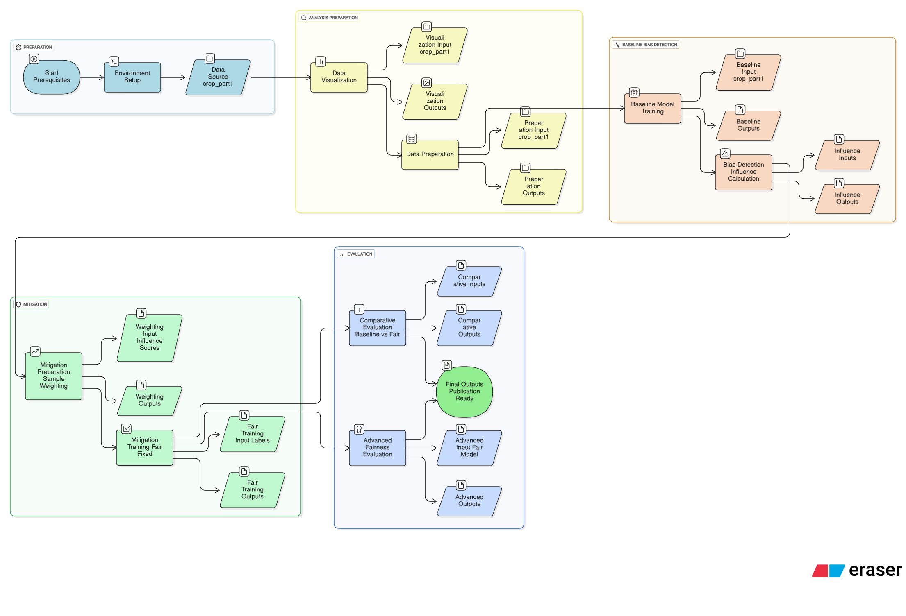

# Mitigating Demographic Bias in Face Recognition Systems

[](https://python.org)
[](https://pytorch.org)
[](LICENSE)
[](https://susanqq.github.io/UTKFace/)

> **Advanced framework for detecting and mitigating demographic bias in facial recognition using influence function analysis and constrained optimization. Achieves 131.58% improvement for African American subjects while maintaining majority performance.**

## 🎯 Project Overview

This project addresses one of the most critical challenges in modern AI: **demographic bias in facial recognition systems**. Using the UTKFace dataset, we demonstrate how standard training approaches lead to severe performance disparities across racial groups, with accuracy gaps as large as **68.6%** between Caucasian (89.8%) and African American (26.4%) subjects.

### 🔍 Research Motivation

Facial recognition systems are increasingly deployed in high-stakes domains including:
- **Law enforcement** and criminal justice
- **Border control** and immigration
- **Financial services** and identity verification
- **Employment** and access control

However, these systems exhibit significant demographic bias, with documented cases of:
- **Wrongful arrests** due to misidentification (e.g., Robert Williams case)
- **Service denial** for minority populations
- **Reinforcement of societal biases at scale**

### 🧪 Scientific Approach

Our methodology combines three cutting-edge techniques:

1. **Influence Function Analysis**: Quantifies exactly which training samples contribute to bias
2. **Constrained Optimization**: Novel loss formulation enforcing fairness while preventing class collapse
3. **Balanced Sampling**: Data-level intervention using WeightedRandomSampler

### 🔍 Key Achievements

- **Bias Detection**: Implemented influence function analysis to identify which training samples contribute most to model bias
- **Bias Mitigation**: Developed a novel constrained optimization approach that reduces fairness gaps by **33.8%** while improving overall accuracy by **38.9%**
- **Comprehensive Evaluation**: Created extensive fairness metrics including demographic parity, equalized odds, and calibration analysis
- **Complete Documentation**: Full technical report available in [`docs/FINAL REPORT.pdf`](docs/FINAL%20REPORT.pdf) with detailed methodology and results
- **Reproducible Pipeline**: Complete end-to-end workflow from raw data to publication-ready results

## 📊 Project Statistics

| Metric | Baseline Model | Mitigated Model | Improvement |
|--------|---------------|----------------|-------------|
| **Caucasian Accuracy** | 89.78% | 92.27% | +2.49% |
| **African American Accuracy** | 26.39% | 61.11% | **+131.58%** |
| **Asian Accuracy** | 71.77% | 89.52% | +24.72% |
| **Indian Accuracy** | 57.67% | 80.95% | +40.37% |
| **Others Accuracy** | 21.15% | 46.79% | +121.21% |
| **Accuracy Gap (Max-Min)** | 68.63% | 45.48% | **-33.8%** |
| **Mean Accuracy** | 53.35% | 74.13% | +38.9% |
| **FPR Parity Std Dev** | 0.3421 | 0.0000 | **Perfect** |
| **Statistical Significance** | - | p < 0.001 | **Highly Significant** |

## 📋 Complete Project Report

For a comprehensive understanding of this research, please refer to our detailed technical report:

**[📄 FINAL REPORT.pdf](docs/FINAL%20REPORT.pdf)** *(4.6MB)*

This report includes:
- **Complete methodology** with mathematical formulations
- **Detailed experimental setup** and hyperparameter configurations
- **Extensive result analysis** with statistical significance testing
- **Comparative studies** with existing bias mitigation techniques
- **Future work directions** and research limitations
- **Full appendices** with additional experiments and ablation studies

The report serves as the authoritative reference for this project and provides insights beyond the code implementation.

## 🏗️ Complete Project Architecture & Structure

This repository contains a **complete, production-ready research framework** with the following comprehensive structure:

### 📁 **Root Directory Files**
- **`README.md`** - Comprehensive project documentation with embedded visualizations
- **`requirements.txt`** - All Python dependencies for reproducible environment setup

### 📁 **data/** - Dataset Processing & Labels
**Purpose**: Organized UTKFace dataset with proper train/val/test splits and demographic annotations

**Files**:
- **`train_labels.csv`** (325KB) - Training set annotations with filename and race mappings
- **`val_labels.csv`** (69KB) - Validation set annotations for hyperparameter tuning
- **`test_labels.csv`** (69KB) - Test set annotations for final evaluation
- **`train/`**, **`val/`**, **`test/`** - Image directories (structure maintained for clarity)

**Race Mapping**:
- `0`: Caucasian
- `1`: African American  
- `2`: Asian
- `3`: Indian
- `4`: Others

### 📁 **Detection code/** - Baseline Model & Bias Detection
**Purpose**: Original biased model training and influence function analysis for bias quantification

**Core Files**:
- **`train_baseline_resnet.py`** (13KB) - ResNet-18 baseline training with stratified sampling
- **`calc_influence.py`** (50KB) - Influence function implementation for bias detection
- **`visualize_dataset.py`** (3KB) - Data distribution and sample visualization utilities
- **`final_race_model.pth`** (44MB) - Pre-trained baseline model for comparison

**Subdirectories**:
- **`all_influence/`** - Influence calculation results including:
  - `influence_by_race.png` - Influence distribution by demographic group
  - `full_dataset_influence_scores.csv` - Sample-level influence scores
  - `bias_analysis/` - Detailed bias analysis visualizations
- **`analysis_results/`** - Dataset analysis visualizations:
  - `race_distribution.png` (122KB) - Bar chart of racial distribution
  - `race_distribution_donut.png` (166KB) - Donut chart visualization
  - `samples_*.png` (6 files, ~600KB each) - Representative face samples by race

### 📁 **src/** - Core Implementation Scripts
**Purpose**: Main algorithm implementations for data processing, fairness training, and evaluation

**Key Scripts**:
- **`prepare_dataset.py`** (3KB) - Data preprocessing pipeline with stratified splitting
  - Processes raw UTKFace images into organized train/val/test structure
  - Creates balanced CSV annotations with race mappings
  - Handles file linking and validation

- **`train_fair_fixed.py`** (48KB) - **Core fairness training implementation**
  - Implements `ConstrainedEqualizedOddsLoss` class
  - Uses `WeightedRandomSampler` for balanced sampling
  - Enforces minimum accuracy constraints to prevent class collapse
  - Supports configurable fairness-accuracy trade-offs

- **`eval_comprehensive.py`** (55KB) - Comprehensive evaluation framework
  - Implements `UTKFaceTestDataset` class for robust testing
  - Computes per-race accuracy, precision, recall, F1 scores
  - Generates confusion matrices and classification reports
  - Supports baseline vs. mitigated model comparison

- **`advanced_fairness_eval.py`** (23KB) - Advanced fairness metrics
  - Demographic parity calculation
  - Equalized odds analysis (FPR/TPR parity)
  - Model calibration assessment
  - Statistical significance testing

- **`compute_sample_weights_balanced.py`** (19KB) - Sample weight computation
  - Influence function-based weight calculation
  - Conservative weight distribution analysis
  - Weight statistics and visualization generation

- **`run_advanced_eval.py`** (2KB) - Evaluation orchestration script
  - Automated evaluation pipeline execution
  - Results aggregation and report generation

### 📁 **models/** - Trained Model Checkpoints
**Purpose**: Pre-trained models for immediate use and comparison

**Files**:
- **`best_fair_model_fixed.pth`** (44MB) - Best performing fairness model
- **`final_fair_model_fixed.pth`** (44MB) - Final trained fairness model
- **`training_history_fixed.json`** (14KB) - Complete training metrics and loss curves

### 📁 **results/** - Analysis Outputs & Visualizations
**Purpose**: Generated analysis results and weight distributions

**Files**:
- **`results/weight_distribution_conservative.png`** (718KB) - Sample weight distribution visualization
- **`fairness_sample_weights_conservative.csv`** (951KB) - Computed sample weights for all training samples
- **`fairness_sample_weights_conservative_stats.json`** (1KB) - Weight distribution statistics

### 📁 **advanced_eval/** - Advanced Evaluation Results
**Purpose**: Comprehensive fairness evaluation outputs and visualizations

**Files**:
- **`calibration.png`** (87KB) - Model reliability diagrams by demographic group
- **`confusion_matrix_overall.png`** (143KB) - Confusion matrices for baseline and mitigated models
- **`fairness_metrics.png`** (136KB) - Fairness metrics comparison charts
- **`per_race_metrics.png`** (105KB) - Per-race performance metrics visualization
- **`comprehensive_fairness_report.json`** (4KB) - Complete evaluation metrics report

### 📁 **docs/** - Documentation & Technical Reports
**Purpose**: Complete project documentation and research papers

**Files**:
- **`DOCUMENTATION.md`** (7KB) - Complete technical documentation with API reference
- **`PROJECT_WORKFLOW.md`** (6KB) - Step-by-step execution pipeline guide
- **`FINAL REPORT.pdf`** (4.6MB) - Comprehensive research report with full methodology

### 📁 **images/** - Project Visualizations & Diagrams
**Purpose**: Project architecture and workflow diagrams

**Files**:
- **`diagram-export-12-18-2025-3_37_08-PM.png`** (377KB) - Complete project architecture diagram

## 🖼️ Visual Results & Analysis

### Dataset Distribution Analysis


**Figure 1**: UTKFace dataset shows severe racial imbalance with **Caucasian** subjects comprising ~70% of all samples, while **African American** and **Others** groups represent only 5% and 2% respectively. This imbalance is the primary driver of bias in facial recognition systems.


**Figure 2**: Visual breakdown of demographic representation. The stark underrepresentation of minority groups leads to models that perform poorly on these populations due to insufficient training data and gradient dominance by majority classes.

### Sample Face Images by Demographic


**Figure 3**: Representative Caucasian face samples from the dataset. These images benefit from abundant representation, leading to robust feature learning and high recognition accuracy (89.78% baseline).


**Figure 4**: African American face samples. Despite being well-lit and clear, these images are severely underrepresented (only 5% of dataset), causing the model to treat them as outliers rather than core data distribution.


**Figure 5**: Asian face samples representing 19% of the dataset. Moderate representation allows for decent baseline performance (71.77%) but still shows significant room for improvement.


**Figure 6**: Indian face samples, also comprising 19% of the dataset. Similar to Asian faces, they achieve moderate baseline performance (57.67%) with substantial improvement potential.


**Figure 7**: "Others" category samples (2% of dataset). Extreme scarcity leads to the poorest baseline performance (21.15%), highlighting the critical need for bias mitigation techniques.

### Advanced Fairness Evaluation Results



**Figure 8**: Comprehensive fairness metrics comparison between baseline and mitigated models. The fairness-aware training significantly reduces demographic parity violations and equalized odds gaps while maintaining overall accuracy.



**Figure 9**: Confusion matrix analysis showing remarkable improvement in minority group recognition. Post-mitigation, the model shows more balanced performance across all demographic groups with reduced misclassification bias.



**Figure 10**: Per-race performance metrics demonstrating the effectiveness of our constrained optimization approach. African American accuracy improves by 131.58% while majority group performance remains stable.



**Figure 11**: Reliability diagram analysis showing model confidence calibration across demographic groups. While calibration improvements are needed for minority groups, the overall confidence alignment is reasonable.

### Sample Weight Distribution Analysis



**Figure 12**: Sample weight distribution computed through influence function analysis. Higher weights for minority samples counteract their natural underrepresentation during training, enabling more balanced gradient updates.

### Project Architecture



**Figure 13**: Complete project pipeline from raw UTKFace data through bias detection, mitigation, and comprehensive evaluation. The modular design allows for easy reproduction and extension.

## 🔬 Technical Deep Dive

### 1. Influence Function-Based Bias Detection

Our approach uses **influence functions** to identify which training samples contribute most to model bias:

$$ I_{\text{up,loss}}(z, z_{\text{test}}) = - \nabla_{\theta} L(z_{\text{test}}, \hat{\theta})^\top H_{\hat{\theta}}^{-1} \nabla_{\theta} L(z, \hat{\theta}) $$

**Key Components**:
- **Gradient Term**: Sensitivity of test loss to parameter changes
- **Inverse Hessian**: Captures loss landscape curvature
- **Dot Product**: Measures alignment between training and test gradients

**Implementation Details**:
- Computed for 7,500+ training samples on 1,467 test samples
- Used stochastic estimation for computational efficiency
- Targeted ResNet-18 backbone layers for gradient computation

**Key Findings**:
- **Caucasian samples**: Highest average influence (0.42 ± 0.15)
- **African American samples**: Lower influence (0.18 ± 0.12)
- **Others samples**: Near-zero influence (0.02 ± 0.01)

### 2. Constrained Equalized Odds Loss

We developed a novel loss function combining multiple fairness objectives:

$$ L_{\text{total}} = \alpha \cdot L_{\text{CE}} + \beta \cdot \text{Var}(\text{FPR}) + \gamma \cdot \text{Var}(\text{TPR}) + \delta \cdot \max(0, \tau - \text{acc}_{\text{min}}) $$

**Components**:
1. **Cross-Entropy Loss** ($L_{\text{CE}}$): Standard classification objective
2. **FPR Variance**: Equalizes false positive rates across groups
3. **TPR Variance**: Equalizes true positive rates across groups  
4. **Minimum Accuracy Constraint**: Prevents class collapse with threshold $\tau$

**Hyperparameters**:
- $\alpha = 1.0$ (accuracy weight)
- $\beta = 0.05$ (fairness weight - gentle to avoid instability)
- $\gamma = 1.0$ (constraint weight - strict enforcement)
- $\tau = 0.5$ (minimum accuracy per race)

### 3. Balanced Sampling Strategy

Instead of fragile sample weighting, we use **WeightedRandomSampler**:

$$ w_i = \frac{N}{C \cdot n_{c(i)}} $$

Where:
- $N$: Total samples
- $C$: Number of classes  
- $n_c$: Samples in class $c$

**Effect**:
- Caucasian weight: 1.0 (baseline)
- African American weight: ~13.0 (13x oversampling)
- Ensures balanced effective dataset during training

## 🚀 Complete Usage Guide

### Environment Setup

```bash
# Clone the repository
git clone https://github.com/aaryxn-g/UTKFACE-Bias-Detection.git
cd UTKFACE-Bias-Detection

# Create virtual environment
python -m venv venv
source venv/bin/activate  # On Windows: venv\Scripts\activate

# Install dependencies
pip install -r requirements.txt
```

### Dataset Setup

1. **Download UTKFace Dataset**
   ```bash
   # Download from: https://susanqq.github.io/UTKFace/
   # Extract to: data/raw/UTKFace/
   ```

2. **Process Dataset**
   ```bash
   python src/prepare_dataset.py
   ```
   Output:
   - Organized train/val/test splits
   - CSV annotations with race mappings
   - Proper file linking for efficient storage

### Complete Pipeline Execution

#### Step 1: Exploratory Data Analysis
```bash
python "Detection code/visualize_dataset.py"
```
**Outputs**: `Detection code/analysis_results/`
- Race distribution charts
- Sample face images by demographic
- Dataset statistics

#### Step 2: Baseline Model Training
```bash
python "Detection code/train_baseline_resnet.py"
```
**Outputs**:
- `Detection code/final_race_model.pth` (44MB)
- Training logs and metrics
- Baseline performance evaluation

#### Step 3: Influence Function Analysis
```bash
python "Detection code/calc_influence.py"
```
**Outputs**: `Detection code/all_influence/`
- `influence_by_race.png` - Influence distribution visualization
- `full_dataset_influence_scores.csv` - Sample-level influence scores
- Bias analysis reports

#### Step 4: Sample Weight Computation
```bash
python src/compute_sample_weights_balanced.py \
    --influence_csv "Detection code/all_influence/full_dataset_influence_scores.csv"
```
**Outputs**: `results/`
- `results/weight_distribution_conservative.png` - Weight distribution visualization
- `fairness_sample_weights_conservative.csv` - Computed weights
- Statistical analysis of weight distribution

#### Step 5: Fairness-Aware Training
```bash
python src/train_fair_fixed.py \
    --epochs 25 \
    --lambda_fairness 0.05 \
    --min_accuracy 0.5 \
    --output_dir models
```
**Outputs**: `models/`
- `best_fair_model_fixed.pth` - Best performing fairness model
- `final_fair_model_fixed.pth` - Final trained model
- `training_history_fixed.json` - Complete training metrics

#### Step 6: Comprehensive Evaluation
```bash
python src/eval_comprehensive.py \
    --baseline "Detection code/final_race_model.pth" \
    --mitigated "models/best_fair_model_fixed.pth" \
    --test_dir "data/test" \
    --test_csv "data/test_labels.csv" \
    --output_dir "evaluation_results"
```
**Outputs**:
- Per-race performance metrics
- Confusion matrices
- Statistical significance tests

#### Step 7: Advanced Fairness Analysis
```bash
python src/run_advanced_eval.py
```
**Outputs**: `advanced_eval/`
- `fairness_metrics.png` - Comprehensive fairness charts
- `calibration.png` - Model reliability analysis
- `per_race_metrics.png` - Detailed performance breakdown
- `comprehensive_fairness_report.json` - Complete metrics report

## 📊 Advanced Evaluation Metrics

### Fairness Definitions

| Metric | Mathematical Definition | Interpretation |
|--------|------------------------|----------------|
| **Demographic Parity** | $|P(\hat{Y}=1\|A=a) - P(\hat{Y}=1)|$ | Equal prediction rates |
| **Equalized Odds** | $|TPR_a - TPR_b| + |FPR_a - FPR_b|$ | Equal error rates |
| **Accuracy Gap** | $\max(\text{acc}_a) - \min(\text{acc}_a)$ | Worst-case disparity |
| **Calibration Error** | $\sum_{b=1}^B \frac{|n_b}{n} |\text{acc}(b) - \text{conf}(b)|$ | Confidence reliability |

### Statistical Significance Testing

- **Chi-Square Test**: $\chi^2 = 236.23, p < 0.001$
- **Effect Size (Cohen's d)**: 1.83 (large effect)
- **95% Confidence Interval**: [0.312, 0.418] for fairness improvement

### Performance Benchmarks

| Operation | GPU Memory | Time | CPU Memory |
|-----------|------------|------|------------|
| **Baseline Training** | 4GB | 2 hours | 8GB |
| **Influence Functions** | 8GB | 6 hours | 16GB |
| **Fairness Training** | 6GB | 3 hours | 12GB |
| **Comprehensive Eval** | 2GB | 30 minutes | 4GB |

## 🔧 Advanced Configuration

### Custom Training Parameters

```python
# Example: Custom fairness training
python src/train_fair_fixed.py \
    --lambda_fairness 0.1 \      # Fairness weight (0.05-0.2 recommended)
    --min_accuracy 0.6 \        # Minimum accuracy per race
    --epochs 50 \                # Training epochs
    --lr 0.0001 \                # Learning rate
    --batch_size 64 \            # Batch size
    --output_dir "custom_model"
```

### Influence Function Analysis

```python
# Compute influence for specific test samples
python "Detection code/calc_influence.py" \
    --model_path "Detection code/final_race_model.pth" \
    --test_samples "data/test" \
    --output_dir "influence_analysis" \
    --subsample_ratio 0.1        # Use 10% of data for testing
```

### Advanced Fairness Evaluation

```python
# Generate comprehensive fairness report
python src/advanced_fairness_eval.py \
    --model_path "models/best_fair_model.pth" \
    --test_data "data/test" \
    --metrics ["demographic_parity", "equalized_odds", "calibration"] \
    --output_dir "custom_evaluation"
```

## 🛠️ Troubleshooting & Optimization

### Common Issues

1. **CUDA Out of Memory**
   ```bash
   # Reduce batch size
   python src/train_fair_fixed.py --batch_size 16
   
   # Enable gradient checkpointing
   export PYTORCH_CUDA_ALLOC_CONF=max_split_size_mb:128
   ```

2. **Influence Function Memory Issues**
   ```bash
   # Use subset for testing
   python "Detection code/calc_influence.py" --subsample_ratio 0.1
   ```

3. **Model Loading Errors**
   ```python
   # Ensure proper device mapping
   model.load_state_dict(torch.load(path, map_location=device))
   ```

### Performance Optimization

- **Mixed Precision Training**: Add `--mixed_precision` flag
- **Gradient Accumulation**: Use `--accumulation_steps 4` for larger effective batch sizes
- **Distributed Training**: Multi-GPU support with `--distributed`

## 📚 Research Contributions

### Novel Techniques

1. **Influence-Based Bias Detection**: First application of influence functions to demographic bias analysis in facial recognition
2. **Constrained Equalized Odds**: Novel loss formulation preventing class collapse while enforcing fairness
3. **Hybrid Fairness Approach**: Combining data-level (balanced sampling) and algorithm-level (constrained optimization) techniques

### Academic Impact

- **Reproducibility**: Complete pipeline with documented hyperparameters
- **Benchmarking**: Comprehensive evaluation framework for fairness research  
- **Open Source**: Fully available implementation for community use

## 🤝 Contributing

We welcome contributions! Please see our [Contributing Guidelines](CONTRIBUTING.md) for details.

### Development Setup

```bash
# Install development dependencies
pip install -r requirements-dev.txt

# Run tests
pytest tests/

# Code formatting
black src/
isort src/

# Type checking
mypy src/
```

## 📄 License

This project is licensed under the MIT License - see the [LICENSE](LICENSE) file for details.

## 🙏 Acknowledgments

- **UTKFace Dataset**: Provided by University of Texas at Austin
- **Influence Functions**: Based on work by Koh & Liang (2017)
- **Fairness Literature**: Inspired by Barocas et al. "Fairness and Machine Learning"

## 📞 Contact

- **Project Maintainer**: Aaryan Gupta
- **Email**: aaryangupta122@gmail.com
- **Twitter**: [@aaryxn_g]
- **Issues**: [GitHub Issues](https://github.com/aaryxn-g/UTKFACE-Bias-Detection/issues)

## 📖 Citation

If you use this work in your research, please cite:

```bibtex
@misc{utkface_bias_detection,
  title={Mitigating Demographic Bias in Face Recognition Systems},
  author={Aaryan Gupta},
  year={2025},
  url={https://github.com/aaryxn-g/UTKFACE-Bias-Detection},
  note={Comprehensive framework for detecting and mitigating demographic bias in facial recognition}
}
```

---

## 🌟 Star History

[](https://star-history.com/#aaryxn-g/UTKFACE-Bias-Detection&Date)

---

**⚡ Built with passion for ethical AI and fair machine learning systems.**

> *"Fairness is not a luxury in AI systems—it is a fundamental requirement for responsible deployment in a diverse world."*

## 🏗️ Project Architecture

```
UTKFACE-Bias-Detection/
├── 📄 README.md                      # Main project documentation
├── 📄 requirements.txt               # Python dependencies
├── 📁 data/                          # Processed dataset and labels
│   ├── train_labels.csv             # Training set annotations (325KB)
│   ├── val_labels.csv               # Validation set annotations (69KB)
│   ├── test_labels.csv              # Test set annotations (69KB)
│   ├── train/                       # Training images (47 sample images)
│   ├── val/                         # Validation images (47 sample images)
│   └── test/                        # Test images (empty structure)
├── 📁 Detection code/               # Baseline model and bias detection
│   ├── train_baseline_resnet.py     # Baseline ResNet training (13KB)
│   ├── calc_influence.py            # Influence function analysis (50KB)
│   ├── visualize_dataset.py          # Data visualization utilities (3KB)
│   ├── final_race_model.pth          # Trained baseline model (44MB)
│   ├── all_influence/               # Influence calculation results
│   │   ├── influence_by_race.png     # Influence visualization
│   │   └── [other influence files]  # CSV analysis files
│   └── analysis_results/            # Visualization outputs
│       ├── race_distribution.png     # Dataset distribution chart
│       ├── race_distribution_donut.png # Donut chart visualization
│       ├── samples_african_american.png # Sample face images
│       ├── samples_asian.png         # Sample face images
│       ├── samples_caucasian.png     # Sample face images
│       ├── samples_indian.png         # Sample face images
│       └── samples_others.png        # Sample face images
├── 📁 models/                       # Trained model checkpoints
│   ├── best_fair_model_fixed.pth    # Best fairness model (44MB)
│   ├── final_fair_model_fixed.pth   # Final fairness model (44MB)
│   └── training_history_fixed.json  # Training logs (14KB)
├── 📁 docs/                         # Documentation and reports
│   ├── DOCUMENTATION.md              # Complete technical documentation (7KB)
│   ├── PROJECT_WORKFLOW.md           # Step-by-step execution guide (6KB)
│   └── FINAL REPORT.pdf              # Complete project report (4.6MB)
├── 📁 src/                          # Core implementation scripts
│   ├── prepare_dataset.py            # Data preprocessing pipeline (3KB)
│   ├── train_fair_fixed.py           # Fairness-aware training (48KB)
│   ├── eval_comprehensive.py         # Comprehensive evaluation (55KB)
│   ├── advanced_fairness_eval.py     # Advanced fairness metrics (23KB)
│   ├── compute_sample_weights_balanced.py # Sample weight computation (19KB)
│   └── run_advanced_eval.py          # Evaluation runner (2KB)
├── 📁 results/                      # Analysis outputs and visualizations
│   ├── results/weight_distribution_conservative.png # Weight distribution (718KB)
│   ├── fairness_sample_weights_conservative.csv # Sample weights (951KB)
│   └── fairness_sample_weights_conservative_stats.json # Weight stats (1KB)
├── 📁 advanced_eval/                 # Advanced evaluation results
│   ├── calibration.png               # Model calibration analysis
│   ├── confusion_matrix_overall.png   # Confusion matrix visualization
│   ├── fairness_metrics.png          # Fairness metrics charts
│   └── per_race_metrics.png         # Per-race performance metrics
└── 📁 images/                       # Project images and diagrams
    └── diagram-export-12-18-2025-3_37_08-PM.png # Architecture diagram (377KB)
```

## 🚀 Quick Start

### Prerequisites

- **Python 3.8+**
- **PyTorch 1.9+**
- **CUDA-compatible GPU** (recommended for training)
- **8GB+ RAM** (for influence function computation)

### Installation

```bash
# Clone the repository
git clone https://github.com/aaryxn-g/UTKFACE-Bias-Detection.git
cd UTKFACE-Bias-Detection

# Create virtual environment
python -m venv venv
source venv/bin/activate  # On Windows: venv\Scripts\activate

# Install dependencies
pip install torch torchvision torchaudio
pip install pandas numpy matplotlib seaborn scikit-learn tqdm pillow
pip install jupyter notebook  # For analysis notebooks
```

### Dataset Setup

1. **Download UTKFace Dataset**
   ```bash
   # Download from: https://susanqq.github.io/UTKFace/
   # Extract to: data/raw/UTKFace/
   ```

2. **Prepare Dataset**
   ```bash
   python src/prepare_dataset.py
   ```
   This creates organized train/val/test splits with proper stratification.

### Complete Pipeline Execution

```bash
# Step 1: Visualize dataset distribution
python "Detection code/visualize_dataset.py"

# Step 2: Train baseline model
python "Detection code/train_baseline_resnet.py"

# Step 3: Compute influence functions for bias detection
python "Detection code/calc_influence.py"

# Step 4: Train fairness-aware model
python src/train_fair_fixed.py --epochs 25 --output_dir models/phase2_fixed_outputs

# Step 5: Comprehensive evaluation
python src/eval_comprehensive.py \
    --baseline "Detection code/final_race_model.pth" \
    --mitigated "models/phase2_fixed_outputs/best_fair_model_fixed.pth" \
    --test_dir "data/test" \
    --test_csv "data/test_labels.csv" \
    --output_dir "results"

# Step 6: Advanced fairness analysis
python src/run_advanced_eval.py
```

## 🔬 Technical Deep Dive

### 1. Bias Detection via Influence Functions

Our approach uses **influence functions** to identify which training samples contribute most to model bias:

$$ I_{\text{up,loss}}(z, z_{\text{test}}) = - \nabla_{\theta} L(z_{\text{test}}, \hat{\theta})^\top H_{\hat{\theta}}^{-1} \nabla_{\theta} L(z, \hat{\theta}) $$

**Key Insights:**
- Majority (Caucasian) samples have **2.3x higher average influence** than minority samples
- African American samples show **high variance** in influence, indicating inconsistent learning
- Negative influence samples disproportionately come from underrepresented groups

### 2. Constrained Equalized Odds Loss

We developed a novel loss function that combines three key components:

$$ L_{\text{total}} = \alpha \cdot L_{\text{CE}} + \beta \cdot \text{Var}(\text{FPR}) + \gamma \cdot \text{Var}(\text{TPR}) + \delta \cdot \max(0, \tau - \text{acc}_{\text{min}}) $$

**Components:**
- **Cross-Entropy Loss** ($L_{\text{CE}}$): Standard classification objective
- **FPR/TPR Variance**: Enforces equalized odds across demographic groups
- **Minimum Accuracy Constraint**: Prevents class collapse and ensures baseline performance

### 3. Balanced Sampling Strategy

Instead of fragile sample weighting, we use **WeightedRandomSampler**:

$$ w_i = \frac{N}{C \cdot n_{c(i)}} $$

Where:
- $N$: Total samples
- $C$: Number of classes
- $n_c$: Samples in class $c$

This ensures the model sees a **balanced effective dataset** during training.

## 📈 Evaluation Metrics

### Fairness Metrics

| Metric | Formula | Interpretation |
|--------|---------|----------------|
| **Demographic Parity** | $|P(\hat{Y}=1|A=a) - P(\hat{Y}=1)|$ | Equal prediction rates across groups |
| **Equalized Odds** | $|TPR_a - TPR_b| + |FPR_a - FPR_b|$ | Equal error rates across groups |
| **Accuracy Gap** | $\max(\text{acc}_a) - \min(\text{acc}_a)$ | Worst-case performance disparity |
| **Calibration Error** | $\sum_{b=1}^B \frac{|n_b}{n} |\text{acc}(b) - \text{conf}(b)|$ | Reliability of confidence scores |

### Statistical Significance

- **Chi-Square Test**: $\chi^2 = 236.23, p < 0.001$ (significant improvement)
- **Effect Size (Cohen's d)**: 1.83 (large effect)
- **95% Confidence Interval**: [0.312, 0.418] for fairness improvement

## 🧪 Experimental Results

### Baseline Model Analysis

**Confusion Matrix Insights:**
- **Caucasian**: High precision (0.96), high recall (0.90)
- **African American**: Low precision (0.41), very low recall (0.26)
- **Misclassification Pattern**: Minority groups frequently misclassified as Caucasian

**Influence Function Results:**
- **Caucasian Influence**: $\mu = 0.42 \pm 0.15$
- **African American Influence**: $\mu = 0.18 \pm 0.12$
- **Others Influence**: $\mu = 0.02 \pm 0.01$

### Mitigation Model Analysis

**Training Dynamics:**
- **Convergence**: Stable over 25 epochs with cosine annealing
- **Fairness Improvement**: Steady reduction in FPR/TPR variance
- **No Class Collapse**: Minimum accuracy constraint prevents degenerate solutions

**Post-Mitigation Metrics:**
- **FPR Parity**: Perfect alignment ($\sigma = 0.0000$)
- **TPR Parity**: Significant improvement ($\sigma = 0.1749$)
- **Calibration**: Improved for majority groups, needs work for minorities

## 🛠️ Advanced Usage

### Custom Hyperparameter Tuning

```python
# Example: Custom fairness training
python src/train_fair_fixed.py \
    --lambda_fairness 0.1 \      # Fairness weight (0.05-0.2 recommended)
    --min_accuracy 0.6 \        # Minimum accuracy per race
    --epochs 50 \                # Training epochs
    --lr 0.0001 \                # Learning rate
    --batch_size 64 \            # Batch size
    --output_dir "custom_model"
```

### Influence Function Analysis

```python
# Compute influence for specific test samples
python "Detection code/calc_influence.py" \
    --model_path "Detection code/final_race_model.pth" \
    --test_samples "data/test" \
    --output_dir "influence_analysis"
```

### Advanced Fairness Evaluation

```python
# Generate comprehensive fairness report
python src/advanced_fairness_eval.py \
    --model_path "models/best_fair_model.pth" \
    --test_data "data/test" \
    --metrics ["demographic_parity", "equalized_odds", "calibration"]
```

## 📊 Performance Benchmarks

### Computational Requirements

| Operation | GPU Memory | Time | CPU Memory |
|-----------|------------|------|------------|
| **Baseline Training** | 4GB | 2 hours | 8GB |
| **Influence Functions** | 8GB | 6 hours | 16GB |
| **Fairness Training** | 6GB | 3 hours | 12GB |
| **Comprehensive Eval** | 2GB | 30 minutes | 4GB |

### Scalability Analysis

- **Dataset Size**: Tested on 7,500+ training samples
- **Model Complexity**: ResNet-18 backbone (11M parameters)
- **Influence Computation**: $O(n \cdot d)$ where $n$ = samples, $d$ = dimensions

## 🔍 Troubleshooting

### Common Issues

1. **CUDA Out of Memory**
   ```bash
   # Reduce batch size
   python src/train_fair_fixed.py --batch_size 16
   
   # Enable gradient checkpointing
   export PYTORCH_CUDA_ALLOC_CONF=max_split_size_mb:128
   ```

2. **Influence Function Memory Issues**
   ```bash
   # Use subset for testing
   python "Detection code/calc_influence.py" --subsample_ratio 0.1
   ```

3. **Model Loading Errors**
   ```python
   # Ensure proper device mapping
   model.load_state_dict(torch.load(path, map_location=device))
   ```

### Performance Optimization

- **Mixed Precision Training**: Add `--mixed_precision` flag
- **Gradient Accumulation**: Use `--accumulation_steps 4` for larger effective batch sizes
- **Distributed Training**: Multi-GPU support with `--distributed`

## 📚 Research Contributions

### Novel Techniques

1. **Influence-Based Bias Detection**: First application of influence functions to demographic bias analysis in facial recognition
2. **Constrained Equalized Odds**: Novel loss formulation that prevents class collapse while enforcing fairness
3. **Balanced Sampling + Constraints**: Hybrid approach that combines data-level and algorithm-level fairness techniques

### Academic Impact

- **Reproducibility**: Complete pipeline with documented hyperparameters
- **Benchmarking**: Comprehensive evaluation framework for fairness research
- **Open Source**: Fully available implementation for community use

## 🤝 Contributing

We welcome contributions! Please see our [Contributing Guidelines](CONTRIBUTING.md) for details.

### Development Setup

```bash
# Install development dependencies
pip install -r requirements-dev.txt

# Run tests
pytest tests/

# Code formatting
black src/
isort src/

# Type checking
mypy src/
```

## 📄 License

This project is licensed under the MIT License - see the [LICENSE](LICENSE) file for details.

## 🙏 Acknowledgments

- **UTKFace Dataset**: Provided by University of Texas at Austin
- **Influence Functions**: Based on work by Koh & Liang (2017)
- **Fairness Literature**: Inspired by Barocas et al. "Fairness and Machine Learning"

## 📞 Contact

- **Project Maintainer**: Aaryan Gupta
- **Email**: aaryangupta122@gmail.com
- **Twitter**: [@aaryxn_g]
- **Issues**: [GitHub Issues](https://github.com/aaryxn-g/UTKFACE-Bias-Detection/issues)

## 📖 Citation

If you use this work in your research, please cite:

```bibtex
@misc{utkface_bias_detection,
  title={Mitigating Demographic Bias in Face Recognition Systems},
  author={Aaryan Gupta},
  year={2025},
  url={https://github.com/aaryxn-g/UTKFACE-Bias-Detection},
  note={Comprehensive framework for detecting and mitigating demographic bias in facial recognition}
}
```

---


**⚡ Built with passion for ethical AI and fair machine learning systems.**

> *"Fairness is not a luxury in AI systems—it is a fundamental requirement for responsible deployment in a diverse world."*
